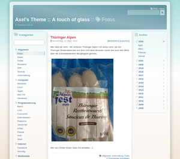

# Axel's theme A Touch Of Glass

## Inroduction

This is a theme for the blog software flatpress (<https://www.flatpress.org/>). 
My theme is based on the code of Leggero theme. Thanks go to NoWhereMan and Drudo!!

This theme offers a clean blog like frontend. This theme was made because
- I wanted a larger font size and 
- I need wider space for the posts
- a selected category or selected year+month is not highlighted or shown in Flatpress

👤 Author: Axel Hahn \
🌐 Source <https://github.com/axelhahn/flatpress-theme-touch-of-glass> \
📜 License: GNU GPL 3.0

## Features

- one theme for 1, 2 or 3 column layout. Just place your widgets to activate / hide the columns
- available areas: 
  - top menu bar for static widget "menu"
  - left column
  - right column
- supports multiple targets: 
  - responsive layout for screen and mobile devices
  - style for printing
- integrated icon set fontawesome 5.x (using CDNJS)
- header with search field and links to RSS feeds
- frontend widgets get an icon in header
- the selected category filter or archive filter is highligted in the frontend widgets
- In the blog header the filtered category or date is shown
- If a blog post is shown then categories and time will be marked
- admin area gets warmer colors and icons from fontawesome icon set

## Installation

**Get the files**

The manual way 1:

- go to <https://github.com/axelhahn/flatpress-theme-touch-of-glass>
- Download the repository as zip 
- extract it

OR the manual way 2:

- `git clone https://github.com/axelhahn/flatpress-theme-touch-of-glass.git`

**Copy the files**

- Copy the theme folder "atog" below ./fp-interface/themes/

**Activate theme**

- Go to the admin of flatpress -> theme and select the theme "Axel's theme A Touch Of Glass" to activate it
- optionally select a wanted style

## Update theme

- Get a new copy of the repository (see installation)
- in flatpress folder delete ./fp-interface/themes/atog/
- Copy the new files in theme folder "atog" below ./fp-interface/themes/
- Open your Flatpress instance in a webbrowser and reload with Shift + Reload to override the browser cache.

## Screenshots

### Default theme

")

### Styles

Red:

Sunny:

Teal:

latest style is White: 

